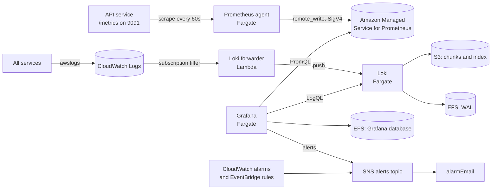

# Observability

How to see what an EVtivity environment is doing: metrics, logs, dashboards, and alerts. There are two views of the same environment:

- **Grafana** (`observability.enabled`): the same dashboards and alert rules as the Helm chart. Application and business metrics (sessions, stations, revenue, OCPP health), plus logs.
- **CloudWatch** (`monitoring.dashboard`, `monitoring.alarms`): AWS-native data only. Load balancer, ECS services, Aurora, Valkey, NAT, logs, and alarm status.

## Architecture



| Component                             | What it does                                                                                                                                                          | Where its data lives                            |
| ------------------------------------- | --------------------------------------------------------------------------------------------------------------------------------------------------------------------- | ----------------------------------------------- |
| Prometheus agent                      | Scrapes the API's `/metrics` endpoint every `observability.prometheus.scrapeIntervalSeconds` and forwards the samples. Stores no history and answers no queries.      | Only a small retry buffer on the task's disk    |
| Amazon Managed Service for Prometheus | Stores the metrics and answers Grafana's PromQL queries. One workspace per environment, `evtivity-<env>`.                                                             | The managed service, 150 days (service default) |
| Loki forwarder                        | A Lambda subscribed to every service's CloudWatch log group. Pushes each batch to Loki with a `service` label (`api`, `ocpp`, `simulator`, `postgres`, `redis`, ...). | None                                            |
| Loki                                  | Stores logs and answers Grafana's LogQL queries.                                                                                                                      | S3 (`loki` bucket), write-ahead log on EFS      |
| Grafana                               | Dashboards and alert rules. Provisioned at every start from the `grafana` bucket: dashboards, alert rules, data sources, SNS contact point.                           | Its own settings and users on EFS               |
| CloudWatch Logs                       | The system of record for logs. Every service writes here first. Loki holds a copy for Grafana.                                                                        | CloudWatch, `logs.retentionDays`                |

Why the metrics store is a managed service: Prometheus needs a durable disk. Fargate tasks lose their local disk on every restart (deploys, the weekly credential redeploy, Spot interruptions), and Prometheus does not support NFS storage such as EFS. The Helm chart runs a Prometheus server on a persistent volume instead. The queries, dashboards, and alert rules are identical in both.

## Finding application errors

Every service writes to CloudWatch Logs first. Grafana's logs dashboard and the CloudWatch logs dashboard both read these groups.

| Log group                                                         | What                                                         |
| ----------------------------------------------------------------- | ------------------------------------------------------------ |
| `/evtivity/<env>/api`                                             | REST API behind the dashboard and the driver portal          |
| `/evtivity/<env>/ocpp`                                            | OCPP server: station connections, transactions, event emails |
| `/evtivity/<env>/worker`                                          | Background jobs: reservations, reports, notifications        |
| `/evtivity/<env>/ocpi`                                            | OCPI roaming                                                 |
| `/evtivity/<env>/css`                                             | Charging station simulator                                   |
| `/evtivity/<env>/csms`, `/evtivity/<env>/portal`                  | nginx for the dashboard and portal                           |
| `/evtivity/<env>/db-job`                                          | Migrations, role grants, settings, and the demo seed         |
| `/aws/rds/cluster/evtivity-<env>/postgresql`                      | Aurora PostgreSQL                                            |
| `/evtivity/<env>/valkey-slow-log`                                 | Valkey slow commands                                         |
| `/evtivity/<env>/grafana`, `loki`, `prometheus`, `loki-forwarder` | The observability stack itself                               |

Where to look:

1. **Grafana**, EVtivity folder, **Logs**: the "All Errors" panel covers every service, then errors and full logs per service. Loki keeps `observability.loki.retentionDays`.
2. **CloudWatch dashboard `evtivity-<env>-logs`**: the same per-service error tables through Logs Insights, in the AWS console.
3. **The CLI**, for exact searches or anything older than Loki keeps:

```bash
# Follow one service
aws logs tail /evtivity/dev/api --follow

# Errors in the last hour. The Node services log JSON: level 50 is error, 60 is fatal.
aws logs filter-log-events --log-group-name /evtivity/dev/ocpp \
  --start-time $(( ($(date +%s) - 3600) * 1000 )) \
  --filter-pattern '?"\"level\":50" ?"\"level\":60" ?ERROR' \
  --query 'events[].message' --output text
```

## Accessing Grafana

`grafana.<zone>` routes to Grafana, and the load balancer's web ACL blocks every source address outside the WAF IP set `evtivity-<env>-grafana-allow`. Edit the set at any time. Changes apply within seconds and need no deploy:

```bash
export AWS_PROFILE=<name>
./scripts/grafana-access.sh dev list
./scripts/grafana-access.sh dev add me              # this machine's public IP
./scripts/grafana-access.sh dev add 203.0.113.0/24  # an office or VPN range
./scripts/grafana-access.sh dev remove 203.0.113.0/24
```

`observability.grafana.allowedCidrs` seeds the set when it is created. Changing that list later replaces the set's contents on the next deploy, including addresses added with the script, so keep it empty or in sync. The block matches any Host header that starts with the Grafana hostname, so adding a port or a trailing dot does not get around it.

Sign in as `admin` with the password in `evtivity/<env>/grafana-admin`:

```bash
aws secretsmanager get-secret-value --secret-id evtivity/dev/grafana-admin \
  --query SecretString --output text
```

## Grafana dashboards

All four are in the EVtivity folder:

| Dashboard        | Shows                                                                                                   | Source     |
| ---------------- | ------------------------------------------------------------------------------------------------------- | ---------- |
| System metrics   | API request rate, errors, latency by route, Node.js heap, event loop lag, GC, OCPP connections and ping | Prometheus |
| Business metrics | Drivers, sites, stations, connectors, sessions, energy, revenue, reservations, payments, popular hours  | Prometheus |
| Logs             | Errors and full logs per service (API, OCPP, worker, simulator, PostgreSQL, Valkey, csms, portal)       | Loki       |
| Alerts           | Firing alerts and the metrics behind each alert rule                                                    | Prometheus |

The dashboards and alert rules are copied from the CSMS repo, which is their source of truth (the Helm chart copies the same files). After a change there:

```bash
./scripts/sync-observability.sh <csms repo>/prometheus/grafana
```

Commit the result and deploy. The deploy uploads the files and restarts Grafana when their content changed.

## CloudWatch dashboards

With `monitoring.dashboard: true` (the default), each environment gets three dashboards built only from AWS data:

| Dashboard               | Shows                                                                                                                                                                                                                                          |
| ----------------------- | ---------------------------------------------------------------------------------------------------------------------------------------------------------------------------------------------------------------------------------------------- |
| `evtivity-<env>-system` | Load balancer requests, errors, p50/p95/p99 response time, open and rejected connections. CPU, memory, and running tasks per service. Aurora capacity, connections, latency. Valkey CPU, memory, connections per node. NAT traffic and health. |
| `evtivity-<env>-logs`   | Logs Insights tables: errors across every service, then errors and recent logs per service. Same log groups as the Grafana logs dashboard.                                                                                                     |
| `evtivity-<env>-alerts` | Status of every CloudWatch alarm, newest change first.                                                                                                                                                                                         |

The system and alerts dashboards link to Grafana for application and business metrics. Logs Insights bills for the data each widget scans, so the logs dashboard defaults to the last hour.

## Alerts

Everything publishes to the `evtivity-<env>-alerts` SNS topic, encrypted with its own KMS key. Set `monitoring.alarmEmail` to subscribe an address. The recipient must confirm the subscription email before anything arrives.

Always on:

- Grafana alert rules (12, the same as the Helm chart), when observability is on
- Credential rotation failed or was abandoned (EventBridge, from CloudTrail)
- An ECS deployment failed, including the scheduled redeploys (EventBridge)

With `monitoring.alarms: true`:

- Load balancer 5xx, unhealthy targets per service, service CPU and memory
- A service running fewer tasks than desired for 10 minutes
- Aurora capacity (or CPU), connections near the services' pool limit, reader lag
- Valkey memory and engine CPU on every node
- NAT instance status checks, or NAT gateway port exhaustion
- The Loki forwarder failing to push logs, when observability is on. Failed batches also land in the `evtivity-<env>-loki-forwarder-failures` queue either way. The originals stay in CloudWatch Logs.

The NAT instance also recovers without anyone subscribed: EC2 moves it to new hardware after a host failure (automatic recovery), and an alarm reboots it when it stops responding.

## Configuration

| Option                                                   | Default    | Notes                                                                        |
| -------------------------------------------------------- | ---------- | ---------------------------------------------------------------------------- |
| `observability.enabled`                                  | `false`    | Prometheus agent, Loki, Grafana, the forwarder, the workspace                |
| `observability.grafana.allowedCidrs`                     | `[]`       | Seeds the Grafana allowlist                                                  |
| `observability.grafana.hostname`                         | `grafana`  | `<hostname>.<subdomain>.<apex>`                                              |
| `observability.prometheus.scrapeIntervalSeconds`         | `60`       | Same as the Helm chart                                                       |
| `observability.loki.retentionDays`                       | `30`       | Loki deletes older logs. The bucket expires them 7 days later as a backstop. |
| `observability.<component>.cpu`, `memoryMiB`, `capacity` | see schema | `FARGATE_SPOT` is about 70% cheaper for dev                                  |
| `monitoring.dashboard`                                   | `true`     | The three CloudWatch dashboards                                              |
| `monitoring.alarms`                                      | `true`     | The CloudWatch alarms listed above                                           |
| `monitoring.alarmEmail`                                  | none       | Subscribes an address to the alerts topic                                    |
| `logs.retentionDays`                                     | `30`       | CloudWatch log groups                                                        |

## Network

Grafana, Loki, Prometheus, and the forwarder run in their own security group. Grafana is reachable from the internet through the load balancer, so it has no network path to Aurora or Valkey. Allowed paths:

- Load balancer to Grafana on 3000
- Grafana and the forwarder to Loki on 3100
- Prometheus to the API metrics port 9091

When a change moves a service to a different security group, deploy it so the new rules exist before the old ones go away. The Network stack deploys before the App stack, so removing a rule there cuts off a service that the App stack has not moved yet.

## Cost

Observability adds about $9 to $12 per month in dev (Fargate Spot) and $26 to $32 in qa and prod: three small Fargate tasks, EFS, the metrics workspace (about $1 to $5 at one scrape target per minute), S3, and the forwarder. Environments without `waf.enabled` also pay about $6 per month for the web ACL that guards Grafana. See [`cost-report.md`](cost-report.md).

## Troubleshooting

| Symptom                                        | Check                                                                                                                                                               |
| ---------------------------------------------- | ------------------------------------------------------------------------------------------------------------------------------------------------------------------- |
| Grafana returns 403                            | Your address is not in the allowlist. `./scripts/grafana-access.sh <env> add me`                                                                                    |
| Grafana returns 503                            | The task is starting or failing its health check. First start runs database migrations on EFS and can take up to 5 minutes. `aws logs tail /evtivity/<env>/grafana` |
| Metrics dashboards show "No data"              | `aws logs tail /evtivity/<env>/prometheus` for scrape or remote-write errors. The API must be running.                                                              |
| Logs dashboard is empty or has gaps            | `aws logs tail /evtivity/<env>/loki-forwarder`, and the `evtivity-<env>-loki-forwarder-failures` queue                                                              |
| No alert emails                                | The subscription must be confirmed. `aws sns list-subscriptions-by-topic` shows `PendingConfirmation` until then.                                                   |
| Loki logs "failed to remove working directory" | Harmless. EFS (NFS) holds a deleted file open briefly, and the next compaction removes it.                                                                          |
